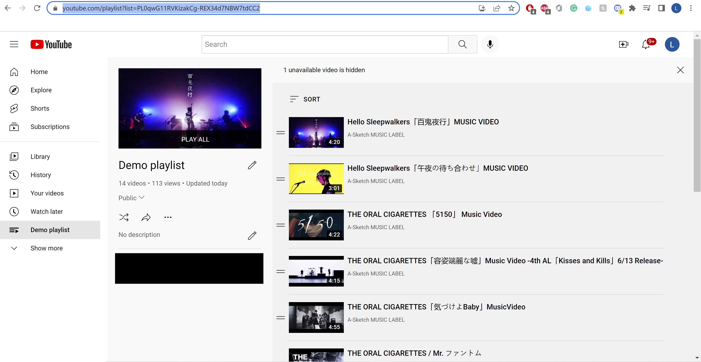
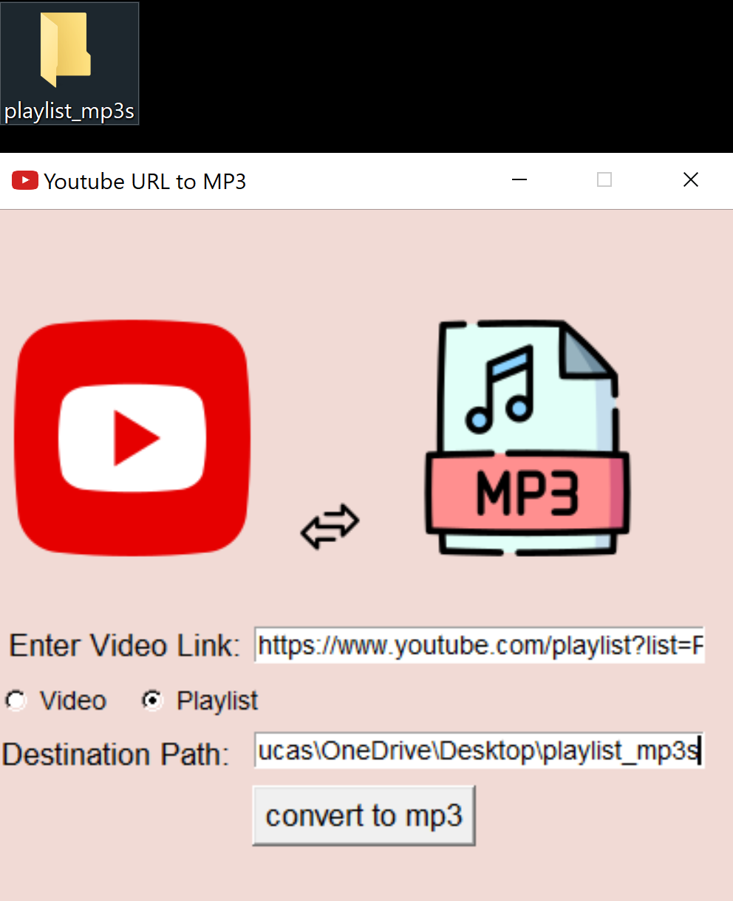
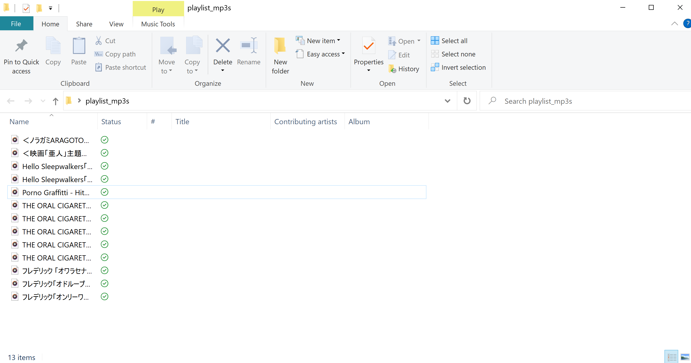

# Youtube URl to Mp3 file Project

## Introduction 
This is my first python project as a beginner. This script uses pytube to convert YouTube URL links of videos and playlists to mp3 file with a simple GUI built with Tkinter. These mp3 files can be downloaded into a specified path/directory; however the default path is "USERPROFILE"\Onedrive\Desktop.

## Install and Details 
The script along with its dependencies can be installed through the executable file converter_installer.exe; it can be run without a python interpreter. 
* The main script executable was constructed with the pyinstaller module
* This main script, 3 pngs, and the ico file was compiled using NSIS 

## Usage

### Contact
l.hsieh.student@gmail.com 
